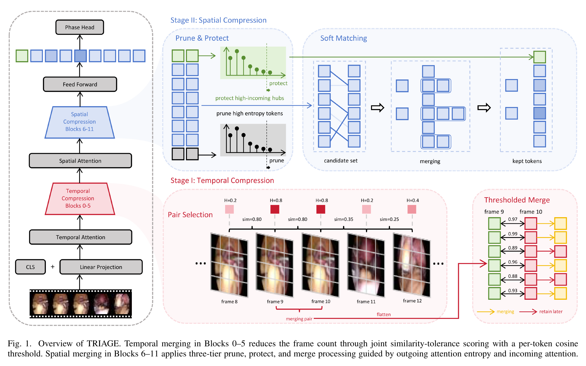
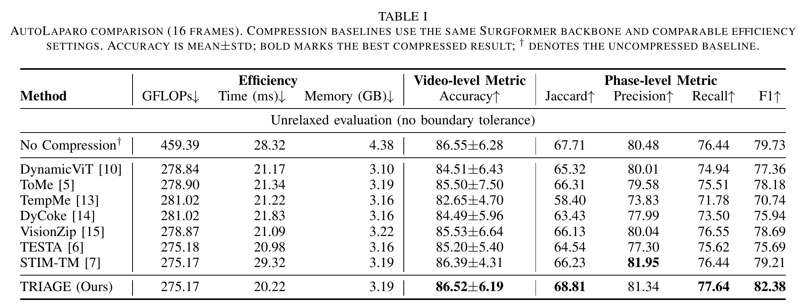
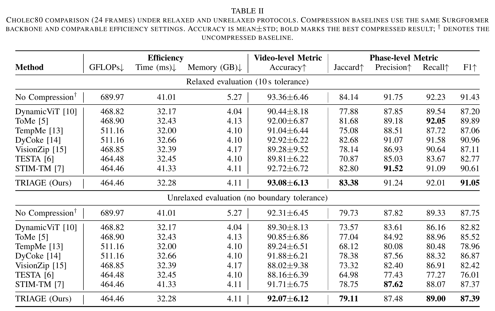
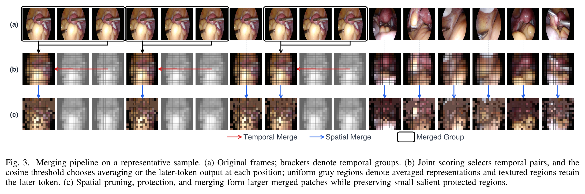
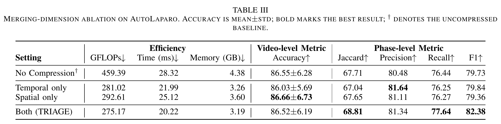

# TRIAGE

**Tiered Token Reduction for Efficient Surgical Phase Recognition**

TRIAGE is a training-free, inference-time token-reduction framework for efficient surgical phase recognition. Built on Surgformer, it combines similarity-and-tolerance-guided temporal merging in early transformer blocks with attention-guided spatial pruning, protection, and merging in later blocks.

## Method Overview

TRIAGE has two complementary stages:

- **Temporal compression (Blocks 0–5):** selects adjacent frame pairs using joint similarity-tolerance scoring and applies a per-token cosine threshold to preserve locally changed content.
- **Spatial compression (Blocks 6–11):** prunes diffuse high-entropy tokens, protects high-incoming-attention hubs, and merges the remaining candidates.
- **No additional training:** the method is applied during inference to a pretrained Surgformer backbone.



## Main Results

### AutoLaparo



### Cholec80



## Qualitative Analysis

The visualization below shows the temporal groups, thresholded temporal decisions, and the spatial token groups produced by TRIAGE on a representative surgical clip.



## Ablation Study

Both temporal and spatial compression contribute to the final performance-efficiency trade-off.



## Installation

```bash
conda create -n TRIAGE python=3.8.13
conda activate TRIAGE
pip install torch==1.13.0+cu117 torchvision==0.14.0+cu117 torchaudio==0.13.0 \
  --extra-index-url https://download.pytorch.org/whl/cu117
pip install -r requirements.txt
```

## Data Preparation

Obtain [Cholec80](https://camma.unistra.fr/datasets/) and [AutoLaparo](https://autolaparo.github.io/) from their official dataset pages and comply with their respective access terms.

Arrange the raw files as follows:

```text
datasets/
├── Cholec80/
│   ├── videos/
│   ├── tool_annotations/
│   └── phase_annotations/
└── AutoLaparo_Task1/
    ├── videos/
    └── labels/
```

Run the preprocessing scripts from the repository root:

```bash
# Cholec80
python datasets/data_preprosses/extract_frames_ch80.py
python datasets/data_preprosses/generate_labels_ch80.py
python datasets/data_preprosses/resize_frames_ch80.py

# AutoLaparo
python datasets/data_preprosses/extract_frames_autolaparo.py
python datasets/data_preprosses/generate_labels_autolaparo.py
python datasets/data_preprosses/resize_frames.py
```

`frame_cutmargin.py` is an optional, separate preprocessing route for Cholec80. It writes `frames_cutmargin/`; the default resize script above reads `frames/`.

## Pretrained Weights

Download `TimeSformer_divST_8x32_224_K400.pyth` from the [TimeSformer model zoo](https://github.com/facebookresearch/TimeSformer#model-zoo) and place it at:

```text
models/TimeSformer_divST_8x32_224_K400.pyth
```

Provide the corresponding finetuned Surgformer checkpoints and use the following layout. See the [Surgformer repository](https://github.com/isyangshu/Surgformer) for backbone training details.

```text
weight/
└── Surgformer/
    ├── AutoLaparo/
    │   └── Surgformer_HTA_16_4/
    │       └── mp_rank_00_model_states.pt
    └── Cholec80/
        └── Surgformer_HTA_KCA_16_4/
            └── mp_rank_00_model_states.pt
```

## Evaluation

The provided launch scripts use four GPUs. Adjust `CUDA_VISIBLE_DEVICES`, `--nproc_per_node`, and the batch size for your machine before running them.

```bash
sh scripts/test_autolaparo.sh
sh scripts/test_cholec80.sh
```

Merge the distributed result files:

```bash
python datasets/convert_results/convert_cholec80.py \
  --nproc_per_node <N_GPUS> \
  --main_path <RESULT_DIR>

python datasets/convert_results/convert_autolaparo.py \
  --nproc_per_node <N_GPUS> \
  --main_path <RESULT_DIR>
```

For the bundled MATLAB evaluation, copy `phase_annotations/` and `prediction/` from `<RESULT_DIR>` into `evaluation_matlab/`. The provided `Evaluate.m` implements the Cholec80-style relaxed protocol with a 10-second boundary tolerance; use `Main.m` only for that protocol. The unrelaxed results reported in the paper, including AutoLaparo, require an unrelaxed evaluator and must not be obtained by running `Main_AutoLaparo.m` unchanged.

## Acknowledgements

This repository builds on the public implementations of [Surgformer](https://github.com/isyangshu/Surgformer) and [STIM-TM](https://github.com/xjiangmed/STIM-TM), with token-merging utilities adapted from [Token Merging (ToMe)](https://github.com/facebookresearch/ToMe). We sincerely thank their authors for the strong foundations they provided for surgical video modeling and efficient spatiotemporal token processing. We also thank the [TimeSformer](https://github.com/facebookresearch/TimeSformer) authors for the Kinetics-400-pretrained initialization used by the Surgformer backbone.

We are grateful to all authors for making their research and code publicly available. Please cite the corresponding works and follow their original licenses when using this repository.
